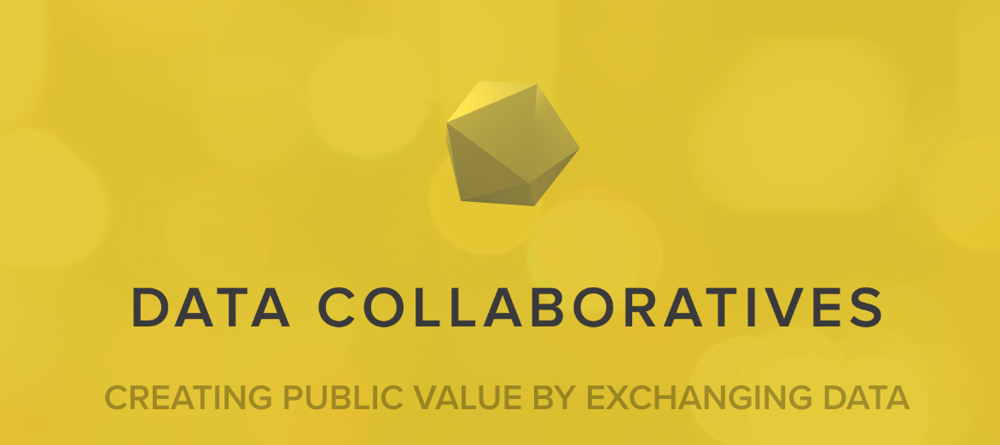

# Mapping public data collaborations in California and beyond!

H/T [NYU GovLab Data Collaboratives](http://datacollaboratives.org/)

This readme aims to provide a common operational picture of public data collaborations in California and beyond! The goal is to build on existing efforts mapping public data (and related) collaborations across the globe including:

- [NYU Gov Lab Data Collaboratives](http://datacollaboratives.org) -- (from 2015-16ish)
- [Apolitical Global Innovation Labs](https://apolitical.co/government-innovation-lab-directory/)
- [Gov Ex Data Standards Directory](http://datastandards.directory/)

## How to contribute 

*Contributing:* This is a living document! Please feel free to submit a PR to improve the list of California data collaborations listed below. If you're not familiar with GitHub please feel free to submit additional data collaboratives via [this google form.](https://docs.google.com/forms/d/e/1FAIpQLSft6Y9cwcgLRAHCzCgHRJrABGoDq5JbRl-BDctjuy5JwtEL-Q/viewform?usp=sf_link)

## List of public data collaborations

| Project Title                     | Type of Data Collaboration | Notes |
|-----------------------------------|----------------------------|-------|
| [UCLA Policy Lab](https://www.capolicylab.org/) | Data warehousing, streamlining research |       |
| [SCAG Regional Data Collaborative](https://datadonuts.la/event/data-donuts-12.html)  | Inter-governmental partnership |       |
| [Berkeley Water Data Collaborative](https://data.berkeley.edu/news/data-collaboratives-moving-knowledge-action) | Aggregating projects from Water Data Challenges and beyond |       |
| [California Data Collaborative](http://californiadatacollaborative.org) | Data warehousing, decision support analytics, streamlining research, curating open data, inter-governmental partnership |       |
| [Mobility Data Specification](https://github.com/CityOfLosAngeles/mobility-data-specification) | Data Standard |       |

## Quantifying government data collaborations -- ARGO winter 18-19 pro-bono marketplace project

This initial exercise is to dig into the number of repositories and contributers at government GitHub projects inventoried at: https://government.github.com/community/

Psuedocode -- do something like:

1. Scrape a list of government github projects from https://government.github.com/community/
2. For each project in that list: 
	- count the number of repositories ( https://developer.github.com/v3/repos/#list-organization-repositories ) and for each repo:
		- count the number of contributors in each repository ( https://developer.github.com/v3/repos/#list-contributors )
		- note the languages used in the repository ( https://developer.github.com/v3/repos/#list-languages )
3. Develop two dataframe with columns <government_name, repo_count> and <government_name, repo_name, contributor_count, primary_language>

The goal of the project is to develop creative ways to visualize the data in the resulting dataframes. One key audience is the California Gov Ops data team. Please see here for a [thread to share visualizations.](https://github.com/argo-marketplace/future_of_california/issues/13)

## Future work 

Please share your ideas in the issues! In the future it would be useful to survey key project metadata including a list of partners, number of staff dedicated to the collaboration, the annual budget of the project and other useful contextual information. 
